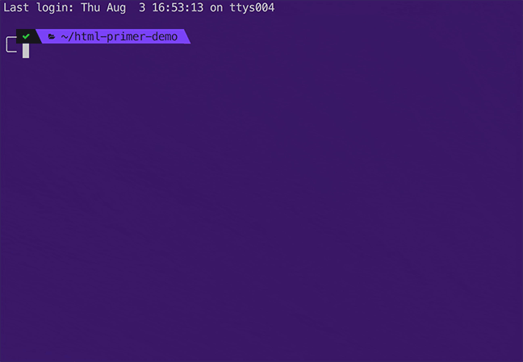

<h1 align="center">html-primer</h1>

<p align="center">
  
</p>

<p align="center">A small CLI utility that quickly generates HTML5 boilerplates.</p>

# Installation

Be sure to install globally so you can use html-primer from the command line in any directory:
```
$ npm install -g html-primer
```

# Usage

You can use `html-primer` or just `html`:
```
$ html-primer [options]
$ html [options]
```

# Options
`-f` or `--fname` Use custom filename (defaults to `index.html`)

`-c` or `--comments` Include comments in the template (defaults to `false`)

`-q` or `--manifest` Include application manifest tag (defaults to `false`)

`-i` or `--icons` Include favicon fields (defaults to `false`)

`-t` or `--twitter` Include Twitter Card metadata (defaults to `false`)

`-o` or `--open-graph` Include Open Graph metadata (defaults to `false`)

`-m` or `--mobile` Include mobile web app metadata (defaults to `false`)

`-j` or `--jquery` Include jQuery (defaults to `false`)

`-n` or `--normalize` Include Normalize.css (defaults to `false`)

`-g` or `--google` Include Google Analytics (defaults to `false` and `UA-XXXXX-X` if no ID is passed)

`-h` or `--help` Display help

# Examples

Generate an HTML5 boilerplate file with the filename `boilerplate.html`, and include comments and google analytics:
```
$ html --fname="boilerplate.html" -c -g
```

Generate an HTML5 boilerplate file with CDN links to jQuery and Normalize.css:
```
$ html -j -n
```

Generate an HTML5 boilerplate file with Google Analytics using a custom ID:
```
$ html -g="UA-12345-6"
```

# Development
```
$ git clone https://github.com/christopherwk210/html-primer.git
$ cd html-primer
$ npm i
$ node ./lib/html-primer.js
```